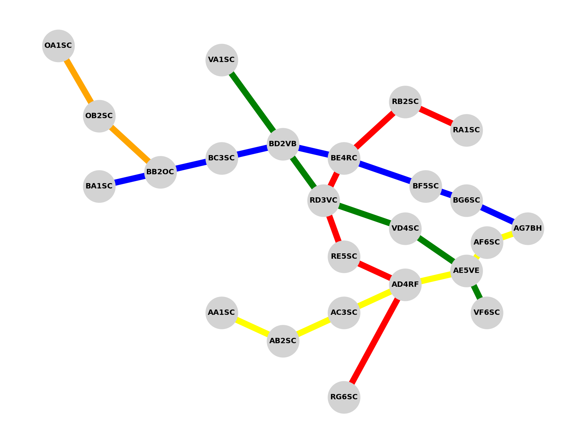

# Experimento Generico

Descrito en la reunión del martes 30 de septiembre de 2025, generaremos un espacio ficticio,
pero con la suficiente rigurosidad para que sea generalizable, escalable y aplicable, tanto a
la arquitectura a desarrollar como a los diferentes modelos de lenguaje que se puedan encontrar
en el mercado, y cómo estos reaccionan ante un contexto en el que no han sido entrenados.

El metro de Madrid, al ser una ciudad turística con tanta información, y cuyo tráfico se presume
lo suficientemente grande como para que las empresas inviertan grandes cantidades de dinero en
entrenar sus modelos con esta información, no es un buen ejemplo, para la verificacion de la eficacia
del uso de información y la limitacion de capacidades.

## Estructura del experimento

1. **Creación del espacio ficticio**:  
   Se diseñó un mapa de metro ficticio con estaciones, líneas y conexiones. Este mapa será lo suficientemente complejo para simular un entorno realista, pero no tan conocido como para que los modelos de lenguaje hayan sido entrenados.  

2. **Generación de datos**:  
   Se generaron datos ficticios para las estaciones y líneas del metro, manteniendo el concepto de color en las líneas, como en los metros de Madrid, Londres o Nueva York.  
   Aquí se tienen las líneas de color amarillo, azul, rojo, verde y naranja. Adicionalmente, se realizó una codificación de las estaciones con el fin de incluso romper la tokenización del modelo:  

   - La codificación de las estaciones es **AB#CD**.  
   - Donde **A** obedece al color de la línea (A = Amarillo, B = Azul, O = Naranja ,R = Rojo, V = Verde).  
   - Donde **B** es la letra en orden alfabético para la estación (en el caso de la línea A va de AA a AG).  
   - **#** obedece al número de conteos de la línea predominante; aunque puede ocurrir que por el cruce la numeración se repita para la estación, lo cual no es un problema ya que se busca confundir al modelo y “romper” su tokenización.  
   - **CD** corresponde al cruce de línea y estación. Puede ser la secuencia **SC** (Sin Conexión) o la línea y estación en donde se cruza. Ejemplos:  
     - **AD4RF** = Es la cuarta estación de la línea A (amarilla); por eso la letra es D. Se cruza con la línea R en la estación F. La numeración 4 corresponde al conteo predominante de la línea A.  
     - **AF6SC** = Es la sexta estación de la línea amarilla; por eso la letra es F. No tiene conexión con ninguna otra línea.  

3. **Rutas**:  
   Se consideró que para ir de extremo a extremo en una misma línea existieran al menos dos rutas posibles. Aún no se ha definido un costo asociado, ya sea de viaje, distancia o tiempo entre tramos.  

4. **Codificación y almacenamiento de la información**:  
   La información se almacenó en un archivo **JSON**, con el fin de que sea fácilmente interpretable y editable por ahora. Se espera su integración futura con una base de datos en un lenguaje de consultas como **SQL**. No obstante, para el experimento actual esto no es relevante.  

## Plano ficticio del metro



Se generó un grafo orientado y codificado con el fin de graficarlo y hacer visible el experimento, esto con el fin de realizar analisis humanos sobre el mismo, y la forma de almacenamiento para que el modelo intérprete es JSON como se presenta a continuacion: 

## Ejemplo de archivo JSON

```json
{
    "lineas": {
      "amarilla": {
        "estaciones": [
          "AA1SC",
          "AB2SC",
          "AC3SC",
          "AD4RF",
          "AE5VE",
          "AF6SC",
          "AG7BH"
        ],
        "sentido_ida": [
          "AA1SCI",
          "AB2SC",
          "AC3SC",
          "AD4RF",
          "AE5VE",
          "AF6SC",
          "AG7BH"
        ],
        "sentido_vuelta": [
          "AG7BH",
          "AF6SC",
          "AE5VE",
          "AD4RF",
          "AC3SC",
          "AB2SC",
          "AA1SCI"
        ]
      }
    }
}
```
## Rutas a considerar

Probemos primero unas rustas siimples, ya que el objetivo es ver como el modelo responde a la información dada, y si es capaz de interpretar las rutas, los cruces y las conexiones.

- Límites de cada línea:
  - Línea Amarilla: AA1SC - AG7BH
  - Línea Azul: BA1SC - AG7BH
  - Línea Roja: RA1SC - RG7SC
  - Línea Verde: VA1SC - VF6SC

- Rutas con cruce:
    - De RD3VC a AG7BH
    - De VD4SC a AA1SC
    - De BE4RC a AF6SC
    - De RE5CS a VD4SC
    - De BA1SC a VF6SC
    - De RA1SC a AB2SC