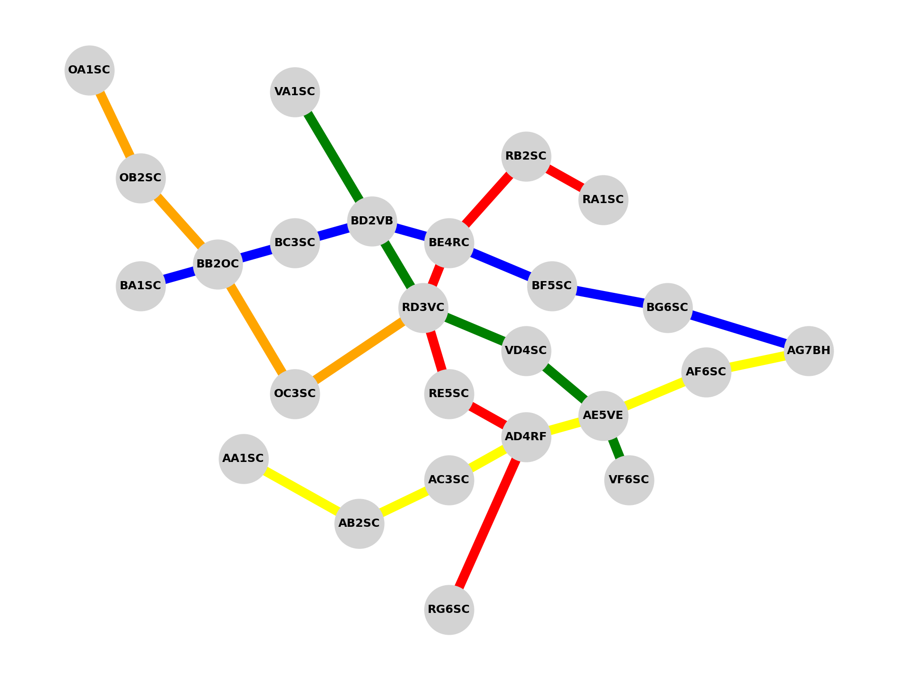

# Semana II  Octubre de 2025 

## Temas relevantes reunion 6/Oct/25

- **Cruce de informacion**
    - Se verifico que Mistral, Gemini, Claude y ChatGPT (el ultimo con errores), son capaces de resolver un grafo de 
manera simple, organizada y correcta, entregando rutas correctas y optimizadas.
    - Se desea integrar informacion de hoteleria, restaurantes, incluso un punto donde se crucen tres lineas diferentes de un
metro ficticio. Para eso se extendera el experimiento generico de un escenario controlado y sobre el cual tendremos informacion veridica y
verificable.

- **Mejora al sistema de transporte**
    - Se agregaron dos estaciones a linea naranja, con una particularidad y es que llega a la estacion RD3VC, es decir, dentro de su
codificacion no esta el OC que indicaria que esa linea pasa por ahi, lo cual rompe con patrones, es un caso que puede ocurrir en lña vida real, pero ayuda
para que el modelo no se confie en patrones y pueda razonar.


Sistema Generico, con las dos nuevas estaciones creadas para la linea naranja.

- **Simulacion de longitud y latitud**
    - Para generar el gráfico anterior se usaron coordenadas ficticias, las cuales ya predefinían la forma de orden anterior, pero esas coordenadas 
eran completamente arbitrarias, y no se podían comparar con un caso realista. Por ende se procedió a hacer una conversión a coordenadas más realistas 
para una ciudad cuyo tamaño fuera considerable. Se seleccionó Madrid como ciudad de referencia y se aplicó una transformación lineal donde cada unidad 
en las coordenadas originales equivale a 0.001 grados geográficos (aproximadamente 111 metros), resultando en un sistema que cubre un área de 55×62 km 
con distancias promedio de 11 km entre estaciones, representativo de una red de transporte metropolitana de gran escala.
    - *Calculo*:  
  Transformacion lineal:  
  La conversión se realizó mediante una transformación afín que preserva la distribución geométrica original mientras escala las coordenadas a un sistema 
de referencia geográfico real:
      $$ Latitud = Latitud_central + x * s $$
      $$ Longitud = Longitud_central + y * s $$
        - Donde (x, y) coordenadas cartesianas originales
        - Latitud_central y Longitud_central = (40.4168, -3.7038) (coordenadas de Madrid)
        - s = 0.001 (factor de escala en grados por unidad)
    - *Parámetros de Escala y Equivalencias Físicas*
  El facto de escala s=0.001 se seleccionó considerando que:
  $$
\begin{align*}
1^\circ \text{de latitud} &\approx 111 \text{km} \\
1 \text{unidad cartesiana} &= s^\circ = 0.001^\circ \approx 111 \text{m}
\end{align*}
$$
    - *El resultado fue el siguiente*:  
  [Resultados Transformacion Coordenadas](estaciones_sistema.csv)

        ```
        ID,Latitud,Longitud,Color
        AA1SC,40.3768,-3.6838,amarilla
        AB2SC,40.4668,-3.7438,amarilla
        AC3SC,40.5368,-3.7038,amarilla
        AD4RF,40.5968,-3.6638,"amarilla, roja"
        AE5VE,40.6568,-3.6438,"amarilla, verde"
        AF6SC,40.7368,-3.6038,amarilla
        AG7BH,40.8168,-3.5838,"amarilla, azul"
        BA1SC,40.2968,-3.5238,azul
        BB2OC,40.3568,-3.5038,"azul, naranja"
        BC3SC,40.4168,-3.4838,azul
        BD2VB,40.4768,-3.4638,"azul, verde"
        BE4RC,40.5368,-3.4838,"azul, roja"
        BF5SC,40.6168,-3.5238,azul
        BG6SC,40.7068,-3.5438,azul
        RA1SC,40.6568,-3.4438,roja
        RB2SC,40.5968,-3.4038,roja
        RD3VC,40.5168,-3.5438,"roja, verde, naranja"
        RE5SC,40.5368,-3.6238,roja
        RG6SC,40.5368,-3.8238,roja
        VA1SC,40.4168,-3.3438,verde
        VD4SC,40.5968,-3.5838,verde
        VF6SC,40.6768,-3.7038,verde
        OA1SC,40.2568,-3.3238,naranja
        OB2SC,40.2968,-3.4238,naranja
        OC3SC,40.4168,-3.6238,naranja
        
        ```


  
