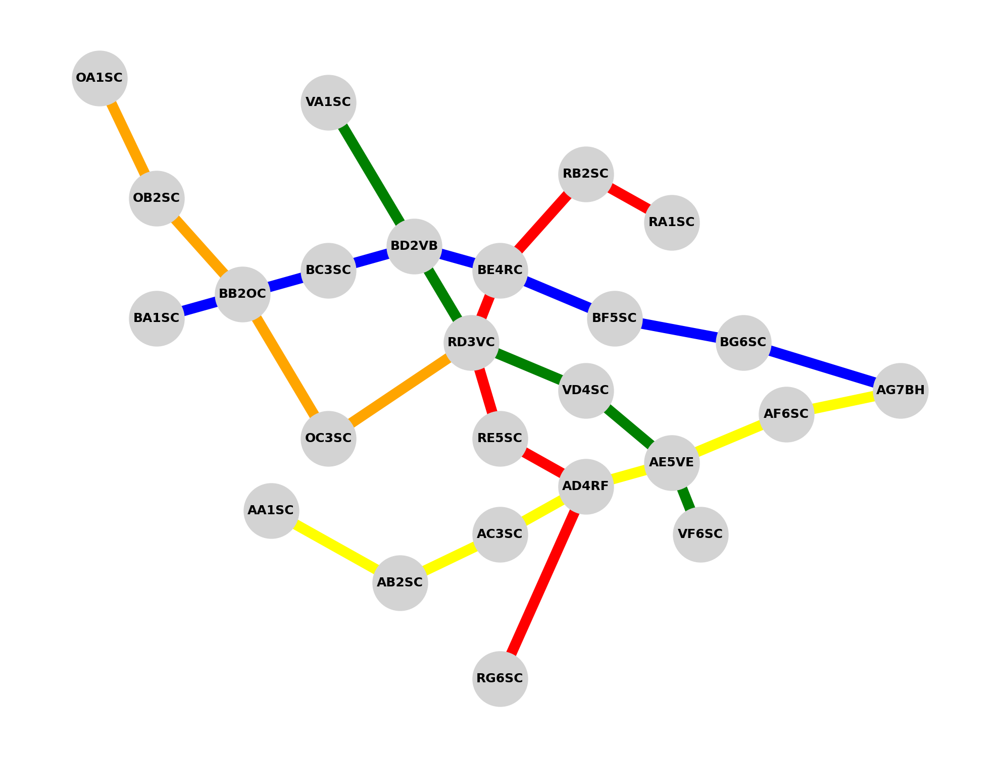

# Semana II  Octubre de 2025 

## Temas relevantes reunion 06/Octubre/2025

- **Cruce de informacion**
    - Se verifico que Mistral, Gemini, Claude y ChatGPT (el ultimo con errores), son capaces de resolver un grafo de 
manera simple, organizada y correcta, entregando rutas correctas y optimizadas.
    - Se desea integrar informacion de hoteleria, restaurantes, incluso un punto donde se crucen tres lineas diferentes de un
metro ficticio. Para eso se extendera el experimiento generico de un escenario controlado y sobre el cual tendremos informacion veridica y
verificable.

- **Mejora al sistema de transporte**
    - Se agregaron dos estaciones a linea naranja, con una particularidad y es que llega a la estacion RD3VC, es decir, dentro de su
codificacion no esta el OC que indicaria que esa linea pasa por ahi, lo cual rompe con patrones, es un caso que puede ocurrir en lña vida real, pero ayuda
para que el modelo no se confie en patrones y pueda razonar.


Sistema Generico, con las dos nuevas estaciones creadas para la línea naranja.

- **Simulacion de longitud y latitud**
    - Para generar el gráfico anterior se usaron coordenadas ficticias, las cuales ya predefinían la distribucion, pero esas coordenadas 
eran completamente arbitrarias, y no se podían comparar con un caso realista. Por ende se procedió a hacer una conversión a coordenadas más realistas 
para una ciudad cuyo tamaño fuera considerable. Se seleccionó Madrid como ciudad de referencia y se aplicó una transformación lineal donde cada unidad 
en las coordenadas originales equivale a 0.0001 grados geográficos (aproximadamente 11,13 metros), resultando en un sistema que cubre un área de 55×62 km 
con distancias promedio de 11 km entre estaciones, representativo de una red de transporte metropolitana de gran escala.
    - *Calculo*:  
  Transformacion lineal:  
  La conversión se realizó mediante una transformación afín que preserva la distribución geométrica original mientras escala las coordenadas a un sistema 
de referencia geográfico real:
  
        $$ Latitud = Latitud\ central + y * s $$
        
        $$ Longitud = Longitud\ central + x * s $$

    - Donde:  
        - (x, y) coordenadas cartesianas originales
        - Latitud_central y Longitud_central = (40.4168, -3.7038) (coordenadas de Madrid)
        - s = 0.0001 (factor de escala en grados por unidad)
    - *Parámetros de Escala y Equivalencias Físicas*  
  El facto de escala s=0.001 se seleccionó considerando que:

    $$
    \begin{align*}
    1^\circ \text{de latitud} &\approx 111,3 \text{km} \\
    1 \text{unidad cartesiana} &= s^\circ = 0.0001^\circ \approx 11,13 \text{m}
    \end{align*}
    $$

    - *El resultado fue el siguiente*:
    ```csv 
        AA1SC,40.4188,-3.7078,amarilla
        AB2SC,40.4128,-3.6988,amarilla
        AC3SC,40.4168,-3.6918,amarilla
        AD4RF,40.4208,-3.6858,"amarilla, roja"
        AE5VE,40.4228,-3.6798,"amarilla, verde"
        AF6SC,40.4268,-3.6718,amarilla
        AG7BH,40.4288,-3.6638,"amarilla, azul"
        BA1SC,40.4348,-3.7158,azul
        BB2OC,40.4368,-3.7098,"azul, naranja"
        BC3SC,40.4388,-3.7038,azul
        BD2VB,40.4408,-3.6978,"azul, verde"
        BE4RC,40.4388,-3.6918,"azul, roja"
        BF5SC,40.4348,-3.6838,azul
        BG6SC,40.4328,-3.6748,azul
        RA1SC,40.4428,-3.6798,roja
        RB2SC,40.4468,-3.6858,roja
        RD3VC,40.4328,-3.6938,"roja, verde, naranja"
        RE5SC,40.4248,-3.6918,roja
        RG6SC,40.4048,-3.6918,roja
        VA1SC,40.4528,-3.7038,verde
        VD4SC,40.4288,-3.6858,verde
        VF6SC,40.4168,-3.6778,verde
        OA1SC,40.4548,-3.7198,naranja
        OB2SC,40.4448,-3.7158,naranja
        OC3SC,40.4248,-3.7038,naranja
  ```
    - *Visualización Geográfica*  
    Si graficaramos las estaciones en un mapa de Madrid, obtenemos la siguiente distribución:

        
        Sistema Generico con coordenadas geográficas simuladas, representando una red de transporte metropolitana en Madrid.
        
    - *Visualización si se el sistema en Madrid*
        
        Sistema Generico sobre un mapa de Madrid, mostrando las estaciones y conexiones de las líneas de transporte.

## Nuevos datos para un cruce de informacion. 


Como una extensión del experimento genérico, se generaron datos sintéticos de hoteles con el objetivo de simular una ciudad 
ficticia. Las ubicaciones geográficas de los hoteles se determinaron mediante una **distribución exponencial centrada en el 
núcleo urbano**, tal que la distancia radial $r$ desde el centro cumple:

$$
r \sim \text{Exponencial}(\lambda), \quad \lambda = \frac{1}{\mu_r}
$$

donde $\mu_r$ es la **distancia media esperada al centro**. El ángulo $\theta$ se selecciona uniformemente:

$$
\theta \sim \mathcal{U}(0, 2\pi)
$$

Las coordenadas geográficas $(\phi, \lambda)$ de cada hotel se aproximan a partir del centro $(\phi_c, \lambda_c)$ mediante:

$$
\phi = \phi_c + \frac{r}{R_\text{Tierra}} \cos(\theta) \cdot \frac{180}{\pi}, \quad
\lambda = \lambda_c + \frac{r}{R_\text{Tierra}} \frac{\sin(\theta) \cdot 180}{\pi \cos(\phi_c)}
$$

donde $R_\text{Tierra} = 6371\,\text{km}$ es el radio de la Tierra.  

Adicionalmente, se asigna un **precio \(P\)** a cada hotel siguiendo una distribución normal:

$$
P \sim \mathcal{N}(\mu_P, \sigma_P^2), \quad P \geq P_\text{min}
$$

donde $\mu_P$ es el precio medio, $\sigma_P$ la desviación estándar, y $P_\text{min}$ el precio mínimo permitido para garantizar valores realistas.  

Este implementacion proporciona un conjunto de datos georreferenciados que refleja de manera consistente la **distribución espacial y económica de los hoteles**, 
lo cual es útil para análisis de planificación urbana y simulaciones de infraestructura turística.

#### **Distribución espacial de los hoteles**

    

#### **Distribucion de Hoteles y lineas de Metro.**


